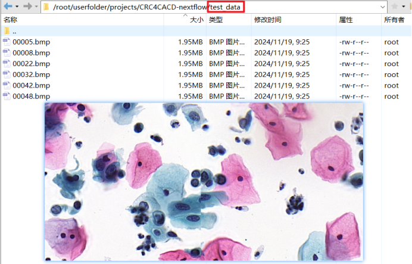
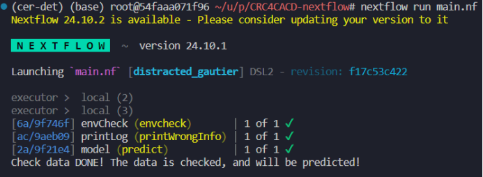
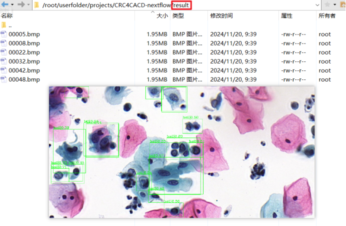
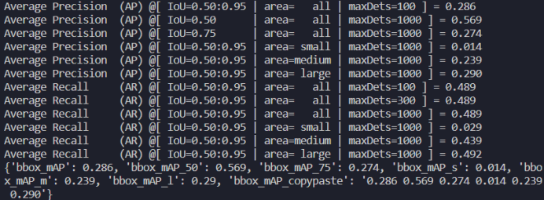

# 基于上下文关系的宫颈异常细胞检测工作流


## 工作流介绍
基于深度学习从宫颈细胞学图像中检测出异常细胞或病变的计算机辅助分析方法是其中最主流的方式。为了模仿细胞病理学家的行为，我们提出了一种新颖的基于注意力机制的级联RoI特征增强方案，通过将细胞关系注意力模块和全局注意力模块引入到proposal-based的检测框架中，分别利用宫颈细胞之间的关系上下文信息和全局上下文信息来提高RoI特征表示能力。通过同时利用细胞级别对象之间的关系和全局图像上下文信息我们提升了对宫颈癌变细胞的检测率。原论文[仓库](https://github.com/CVIU-CSU/CR4CACD)。

本工作流围绕已经训练完成的检测器对输入的批量宫颈细胞图像进行病灶检测搭建了工作流，其中检测类别共为**11个异常类别**ascus，asch，lsil，hsil，scc，agc，trichomonas，candida，flora，herps，actinomyces。分别是为对于鳞癌的TBS评级：意义不明的不典型鳞状细胞（ASCUS）、低度鳞状上皮内病变（LSIL）、非典型鳞状上皮细胞不除外高度鳞状上皮内病变（ASC-H）、高度鳞状上皮内病变（HSIL）、鳞癌（SCC），对于腺癌的诊断：非典型腺上皮细胞（AGC）以及5种微生物感染：trichomonas、candida、flora、herps、actinomyces。

用户输入宫颈细胞图像（2D），首先会判断输入数据是否符合要求，如符合模型的输入要求，会生成相应的数据文件，然后根据用户的需求从模型库中加载对应的已经训练好的模型，最后在输出文件夹中输出包含模型预测出的检测框的图片。

## 安装
```bash
# 安装python环境
conda create -n cer-det python==3.7
conda activate cer-det
pip install torch==1.7.1 torchvision==0.8.2 torchaudio==0.7.2 # 可根据cuda版本修改安装命令,但torch版本最好相同
pip install yapf==0.32.0
pip install openmim
mim install mmcv-full==1.2.0
cd model
pip install -r requirements/build.txt
pip install -v -e .
```
除此之外还需要安装nextflow环境，根据[官网引导](https://www.nextflow.io/docs/latest/install.html)进行安装。

下载模型权重，放到`CRC4CACD-nextflow/checkpoints`中，权重`cas_rram_gram_multi_epoch_24.pth`下载位置：[[百度云]](https://pan.baidu.com/s/1saPgVLNCcexRyseY2su_CA?pwd=ttt6)。
## 使用
1. 将需要推理的图像放到`test_data`文件夹下。

2. 运行nextflow指令。

```bash
nextflow run main.nf
```
3. 在`result`文件夹中查看结果。


## 测试数据集
测试数据为公开数据集**ComparisonDetectorDataset**，数据量总计7410张，共有51445个检测框，包含了11种类别的宫颈病变细胞，随机选取6666张图片作为训练集，744张图片作为测试集。 
在ComparisonDetectorDataset数据上包含5112个检测框的744个图像样本进行测试，AP达到了0.286，AP@50达到了0.569等。
测试结果如下：

说明：本仓库中的`test_data`仅为原测试集的一部分，并且不包含ground truth，完整数据集可从此处下载：[[ComparisonDetector]](https://pan.baidu.com/s/1ynvNKBmf-s9GaUkTEUvTwA?pwd=fphm)。